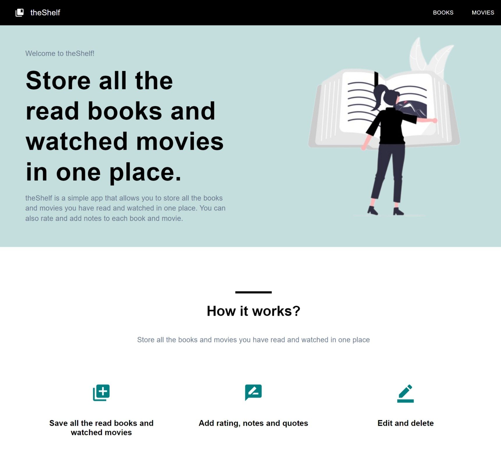
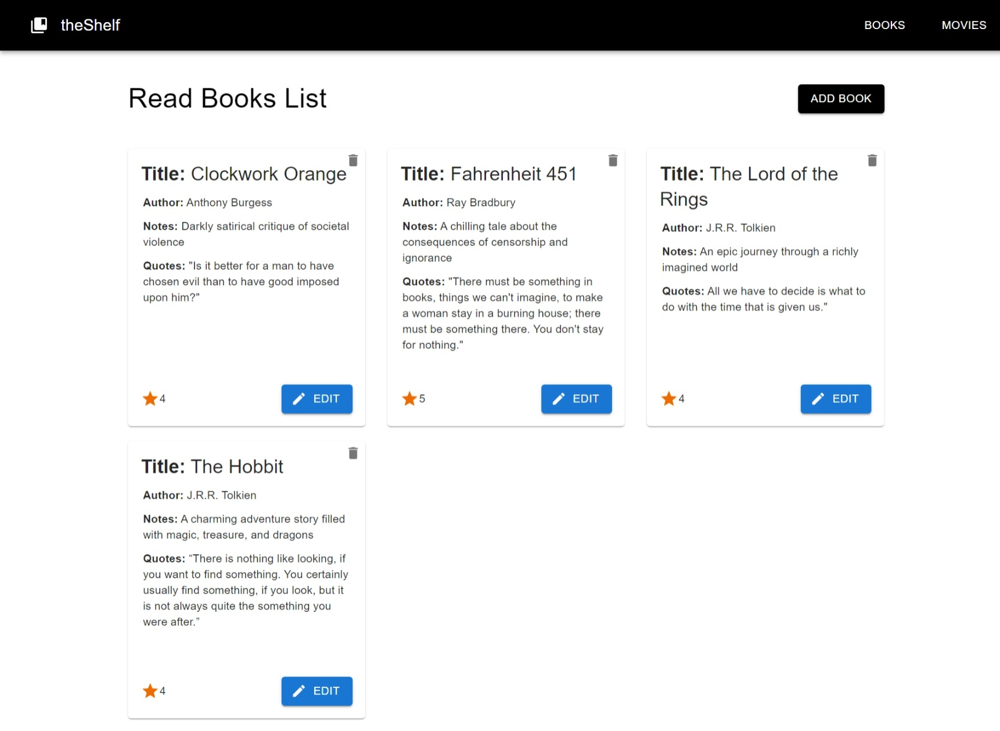
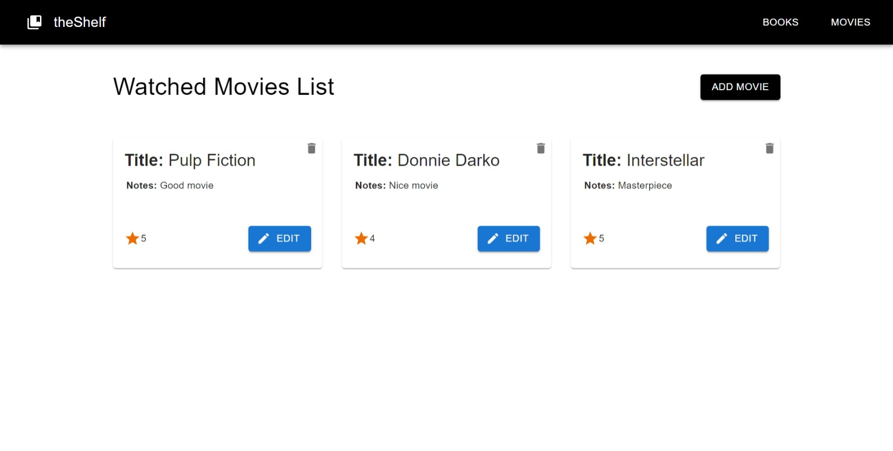
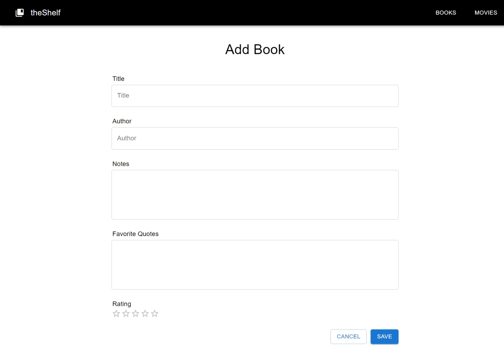
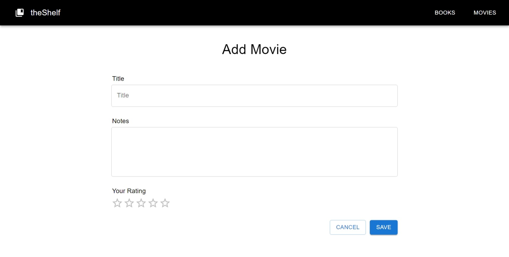

# theShelf

## Quick Overview

The primary objective of this project is to implement my knowledge of React, and create a simple web application that allows users to create a list of books they have read, and movies they have watched. The project uses props, contexts, hooks, routing. To save all the data after the page refresh, the project uses JSON Server. The components are built using Material UI.

## Pages

### Home Page:

### Books Page:

### Movies Page:

### Add Book Page:

### Add Movie Page:

## To-Do

- Add search bar
- Add possibility to filter the list of books and movies
- Add sidebar for filters
- Add possibility to sort the list of books and movies
- Add pagination
- Add user registration and login
